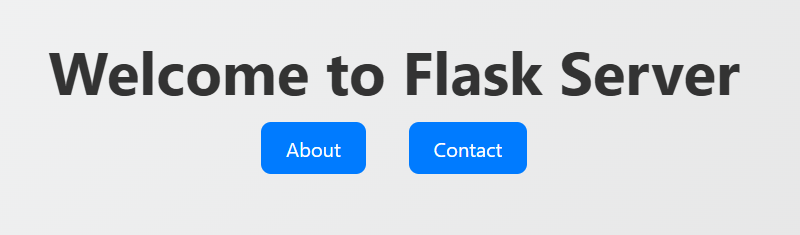
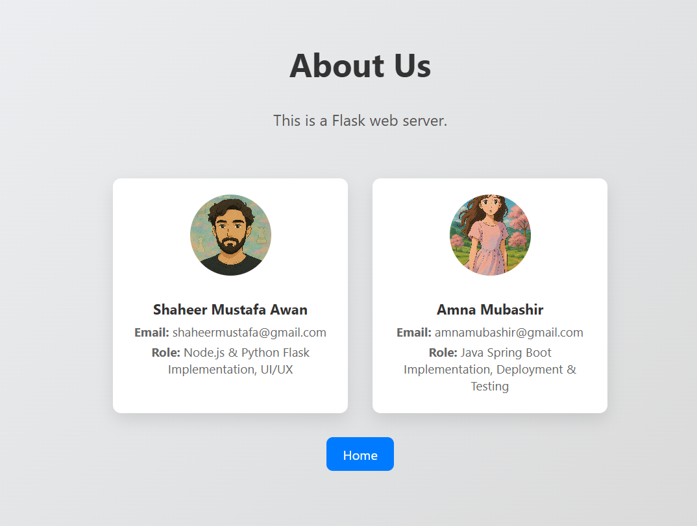
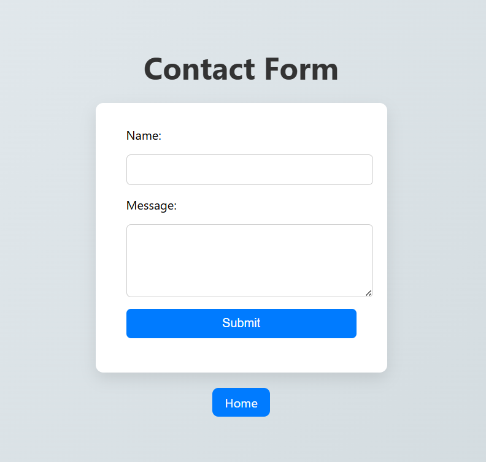
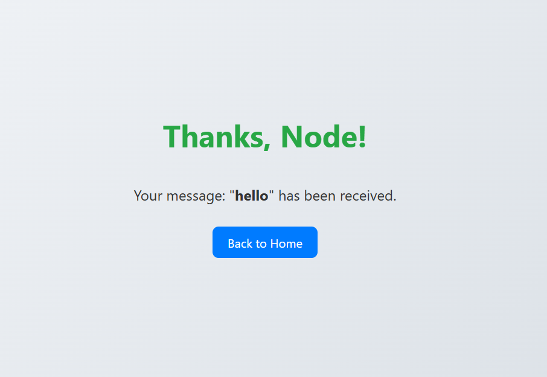

# 🌐 Simple HTTP Web Server Project

This project demonstrates a basic HTTP web server using multiple frameworks:
- Python (Flask)
- Node.js (Express)
- Java (Spring Boot)

The servers serve static HTML pages and handle HTTP GET and POST requests (e.g., contact form submission).

---

## 🚀 Features

- Serve static HTML pages: Home, About, Contact, Thank You
- Handle GET requests (e.g., display content)
- Handle POST requests (e.g., contact form submission)
- Maintain a log file of user submissions
- Form data passed to thank-you page dynamically using query strings
- Responsive and styled front-end pages

---

## 🧑‍💻 How to Run

### 🔹 Flask Server (Python)
1. Go to `Flask` folder
2. Run the following:
   ```bash
   pip install flask
   python app.py
3. Access the server at: http://localhost:5000

### 🔹 Express Server (Node.js)
1. Go to node_server folder
2. Run the following:
   ```bash
   npm install
   npm start
3. Access the server at: http://localhost:3000

---

### 🔹 Spring Boot Server (Java)
1. Go to `springboot` folder  
2. Make sure you have Java and Maven installed:
   - [Java JDK 21+](https://adoptium.net/en-GB/temurin/releases/)
   - [Apache Maven](https://maven.apache.org/download.cgi)
3. Add both to your system `PATH` and confirm:
   ```bash
   java -version
   mvn -v
   ```
4. Then run the server:
   ```bash
   mvn spring-boot:run
   ```
5. Access the server at: [http://localhost:8000](http://localhost:8000)

---

## 📬 Contact Form

- Form in `/contact` allows users to submit `name`, and `message`
- On submission, it redirects to `/thankyou.html?name=...&message=...`
- A log file `logs.txt` is created and appended with each submission

---

## 🛠 Technologies Used

- HTML, CSS
- Python (Flask)
- Node.js (Express)
- Java (springboot)

---

## 📸 Screenshots

> _Include screenshots of your pages here: Home, About, Contact form, Thank You screen_




---

## 📄 License

This project is created for educational purposes for the **CS3001 Computer Networks** course at **FAST NUCES Karachi (Spring 2025)**.

---

## 👨‍💻 Team Members

- **Shaheer Mustafa Awan** – Node.js & Python Flask Implementation, UI/UX  
- **Amna Mubashir** – Java Spring Boot Implementation, Deployment & Testing  

